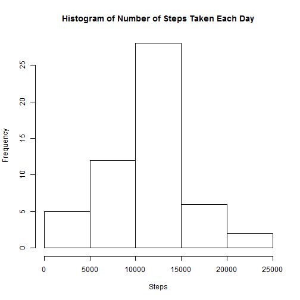
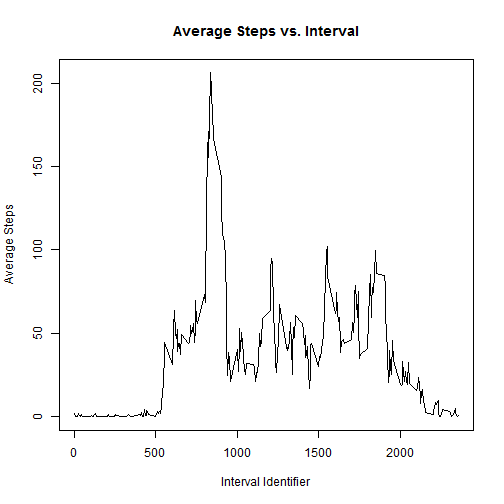
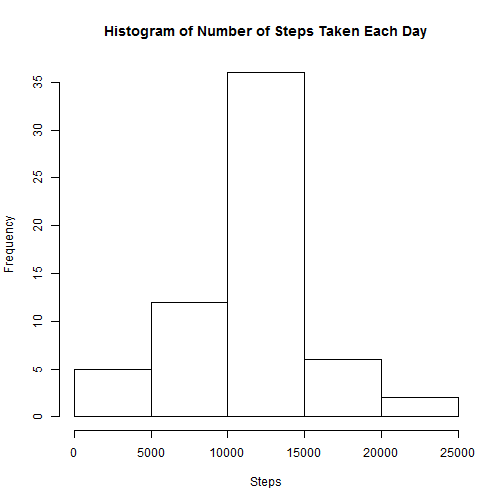
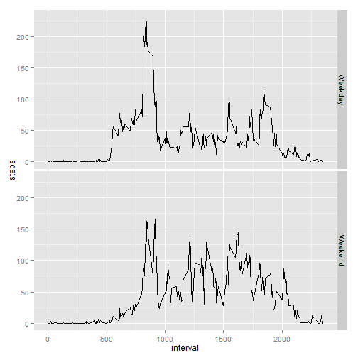

Reproducible Research: Peer Assessment 1
=========================================

## Loading and preprocessing the data  
Please make sure you set the "activity.zip" is in the working directory.

```r
## initiate ggplott2 for later use
## unzip data and read it in
library(ggplot2)
unzip("activity.zip")
data<-read.csv("activity.csv")
```


## What is mean total number of steps taken per day?  
1. Make a histogram of the total number of steps taken each day.

```r
##sum the number of steps per day
steps<-tapply(data$steps,data$date,sum)
##output histograms
hist(steps,main="Histogram of Number of Steps Taken Each Day",xlab="Steps")
```

 
2. Calculate and Report the mean and median total number os steps taken per day.

```r
## find mean/median while ignoriing missing observations
mean_steps<-mean(steps,na.rm=T)
median_steps<-median(steps,na.rm=T)

mean_steps
```

```
## [1] 10766
```

```r
median_steps
```

```
## [1] 10765
```
The mean number of steps is 1.0766 &times; 10<sup>4</sup> and the median is 10765.

## What is the average daily activity pattern?  
1. Make a time series plot of the 5-minute interval (x-axis) and the average 
number of steps taken, averaged across all days(x-axis).

```r
## average the steps accross all days
interval_steps<-tapply(data$steps,data$interval,mean,na.rm=T)
##modify the variable to make is suitable for plotting
data_2<-data.frame(interval_steps)
data_2$intervals<-rownames(data_2)
row.names(data_2)=NULL
## plot the line plot
plot(data_2$intervals,data_2$interval_steps,type="l",
     main="Average Steps vs. Interval",
      xlab="Interval Identifier",
      ylab="Average Steps")
```

 

2. Which 5-minute interval, on average accross all days in the dataset, 
contains the maximum number of steps?


```r
## basic code for finding and printing the max
max_steps<-max(data_2$interval_steps)
max_interval<-data_2[data_2$interval_steps==max_steps,2]
max_steps
```

```
## [1] 206.2
```

```r
as.numeric(max_interval)
```

```
## [1] 835
```
 
Thus, the interval with the highest average steps is 835 with 
206.1698 number of steps.

## Imputing missing values  

1. Calculate and report the total number of missing values in the dataset.


```r
##returns True for "NA's" and False for complete observations
na_vector<-is.na(data$steps)
## summing the bool vector gives the number of True instances, as True=1 and 
## False=0
number_na<-sum(na_vector)
number_na
```

```
## [1] 2304
```
The number of missin values in this data set is 2304.

2. Devise a strategy for filling in all the missing values in the data. 
This strategy does not need to be sophisticated. I used means for the five
minute intervals to replace the missing values. I matched the five minute interval
and replaced the corresponind steps in the new data set with the average mean
for accross all days for that 5-minute interval.

3. Create a new dataset that is equal to the original dataset 
but with the missing data filled in. I also prinited the first ten values of the 
data set to show that the NA's are gone. 

```r
## initialize a new data frame
data_3<-data
## iterate across all rows
for (i in 1:length(na_vector)) {
    ## check for NA's
    if (na_vector[i]==T) {
        ## replace the NA with the correspondin mean of the time interval
        data_3$steps[i]<-interval_steps[[as.character(data_3$interval[i])]]
        ## round as steps are considered integers
        data_3$steps[i]<-round(data_3$steps[i],0)
    }
}
## show a bit of data to demonstrate that the NA are indeed gone
data_3[1:10,]
```

```
##    steps       date interval
## 1      2 2012-10-01        0
## 2      0 2012-10-01        5
## 3      0 2012-10-01       10
## 4      0 2012-10-01       15
## 5      0 2012-10-01       20
## 6      2 2012-10-01       25
## 7      1 2012-10-01       30
## 8      1 2012-10-01       35
## 9      0 2012-10-01       40
## 10     1 2012-10-01       45
```

4. Make a histogram of the total number of steps taken each day and Calculate and 
report the mean and median total number of steps taken per day.


```r
##sum the number of steps per day
steps<-tapply(data_3$steps,data_3$date,sum)
##output histograms
hist(steps,main="Histogram of Number of Steps Taken Each Day",xlab="Steps")
```

 


```r
## calculate new mean/median - see above
mean_steps_2<-mean(steps)
median_steps_2<-median(steps)

mean_steps_2
```

```
## [1] 10766
```

```r
median_steps_2
```

```
## [1] 10762
```

Yes the new values do have some impact on the estimates of the total daily number
of steps.   

```r
## just a little table to see how the values have changed
comp_table<-data.frame(c(mean_steps,median_steps),c(mean_steps_2,median_steps_2))
rownames(comp_table)<-c("mean","median")
colnames(comp_table)<-c("old","new")
comp_table
```

```
##          old   new
## mean   10766 10766
## median 10765 10762
```

* the new mean is slightly lower then bofore: old -1.0766 &times; 10<sup>4</sup> vs new 
1.0766 &times; 10<sup>4</sup>.   
* the median is also lower: old 10765 vs new 1.0762 &times; 10<sup>4</sup>
* getting rid of the missing values did not change the skewness, as the 
median is lower than the the mean in both cases.That is in both cases
the distribution is negatively skewed. 

## Are there differences in activity patterns between weekdays and weekends?

1.Create a new factor variable in the dataset with two levels -- "weekday" 
and "weekend" indicating whether a given date is a weekday or weekend day.


```r
## convert to date objects
data_3$date<-weekdays(as.Date(data_3$date))
## create a numeric vector 0->weekday, 1->weekend
day_factor<-as.numeric((data_3$date=="Saturday")|(data_3$date=="Sunday"))
## initiate the factor
day_factor<-factor(day_factor,labels=c("Weekday","Weekend"))
## write in the factor into the data frame
data_3$date<-day_factor

## find the means steps across the factor levels, seperated by interval
data_4<-aggregate(steps~date+interval,mean,data=data_3)
```

2.Make a panel plot containing a time series plot (i.e. type = "l") 
of the 5-minute interval (x-axis) and the average number of steps taken, 
averaged across all weekday days or weekend days (y-axis). 


```r
## use ggplot to plot the two line plots on top of each other
ggplot(data=data_4, aes(x=interval, y=steps, group=1)) + geom_line()+facet_grid(date~.)
```

 

